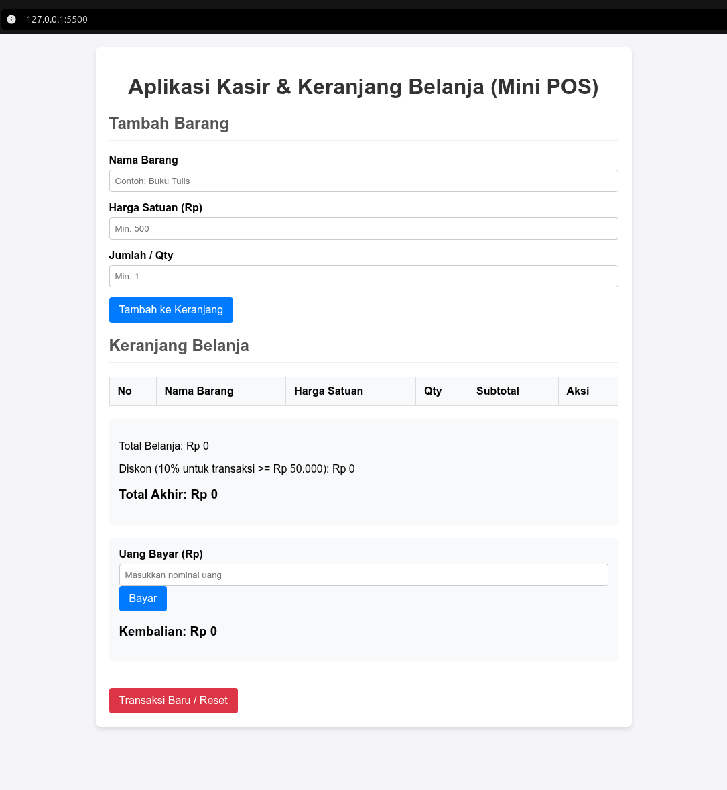
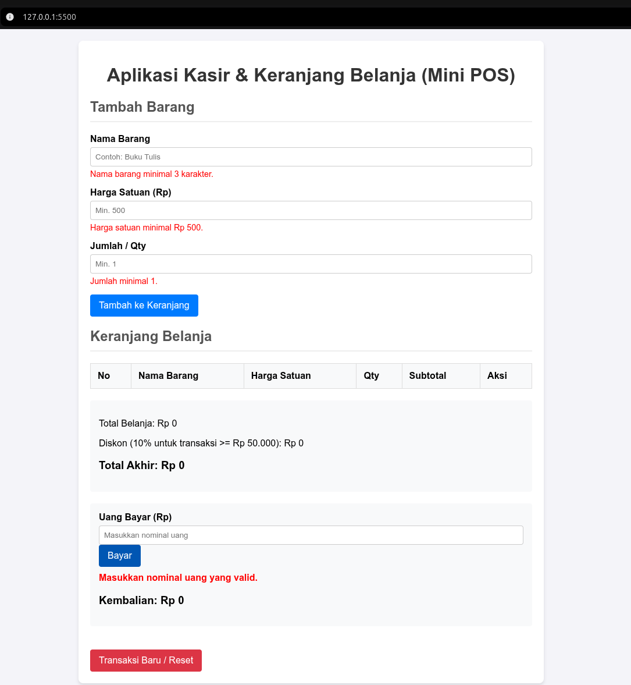
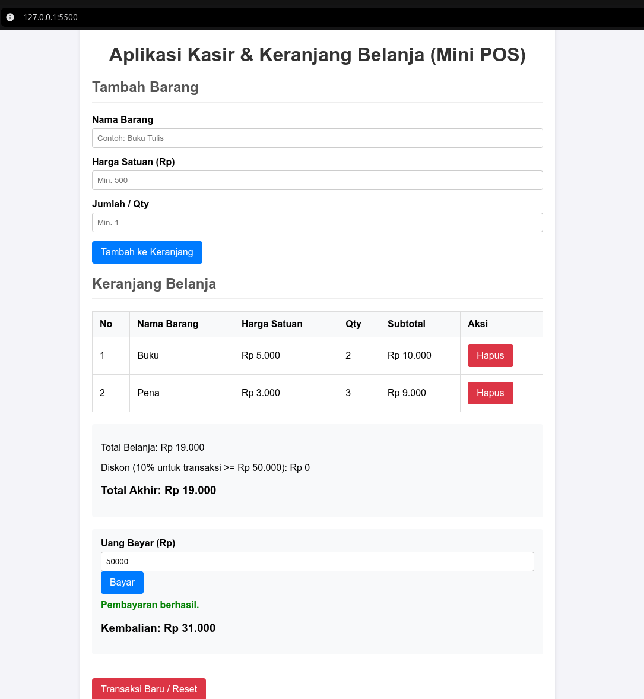

# Mini POS - Aplikasi Kasir & Keranjang Belanja Sederhana

**Identitas**
- **Nama Lengkap:** Febrian Yoel Anggara Saputra
- **NIM:** 124140031
- **Kelas Praktikum:** RB

## Deskripsi Aplikasi
Aplikasi Kasir & Keranjang Belanja Sederhana (Mini POS) adalah aplikasi berbasis web yang digunakan untuk mencatat transaksi penjualan, mengkalkulasi subtotal dan total belanja secara otomatis, serta memberikan fitur pembayaran dan perhitungan kembalian. Aplikasi ini dibuat sebagai tugas praktikum untuk menerapkan konsep-konsep dasar JavaScript seperti manipulasi DOM, penanganan event, dan penyimpanan data persisten menggunakan `localStorage`.

## Panduan Menjalankan
1. Clone atau download repository ini ke komputer lokal.
2. Buka folder proyek tersebut di text editor seperti Visual Studio Code.
3. Jalankan file `index.html` di browser menggunakan ekstensi **Live Server** di VS Code, atau cukup klik ganda (double-click) pada file `index.html` untuk membukanya di browser favorit Anda.

## Daftar Fitur
- [x] Validasi form input (Nama Barang min 3 karakter, Harga Satuan min 500, Qty min 1).
- [x] Menambahkan barang ke dalam tabel keranjang belanja.
- [x] Perhitungan otomatis subtotal per barang.
- [x] Perhitungan otomatis total belanja keseluruhan.
- [x] Kalkulator diskon otomatis (10% jika total >= Rp 50.000).
- [x] Kalkulator pembayaran dan perhitungan uang kembalian.
- [x] Hapus item dari keranjang belanja.
- [x] Penyimpanan data secara persisten di browser menggunakan `localStorage`.
- [x] Tombol "Transaksi Baru" untuk mereset seluruh data belanja.

## Tangkapan Layar (Screenshot)
*(Tambahkan file gambar screenshot ke repository dan tautkan di sini)*
- Tampilan form input utama: 
- Tampilan saat validasi error: 
- Tampilan hasil perhitungan dan tabel riwayat: 

## Penjelasan Teknis Singkat
- **Validasi Input:** Dilakukan di dalam event listener `submit` pada form. Masing-masing input (`nama`, `harga`, `qty`) divalidasi panjang dan nilainya. Jika terdapat kesalahan, akan memunculkan pesan merah di bawah input terkait dan variabel boolean `isValid` menjadi `false` sehingga mencegah data ditambahkan.
- **Algoritma Kalkulator:** Subtotal dihitung dengan `harga * qty`. Seluruh subtotal dijumlahkan untuk mendapatkan `totalBelanja`. Diskon 10% dihitung jika `totalBelanja >= 50000`. `totalAkhir` adalah selisih antara `totalBelanja` dan diskon. Saat pengguna memasukkan `uangBayar`, aplikasi memeriksa apakah nominal uang cukup, lalu menghitung `kembalian`.
- **Mekanisme Serialisasi `localStorage`:** Keranjang direpresentasikan dalam bentuk array of objects (`cart`). Setiap kali ada penambahan atau penghapusan item, array `cart` diubah ke bentuk string (serialisasi) menggunakan `JSON.stringify(cart)` dan disimpan ke dalam `localStorage`. Saat halaman dimuat ulang, data diambil dan di-parse kembali menggunakan `JSON.parse()`.
